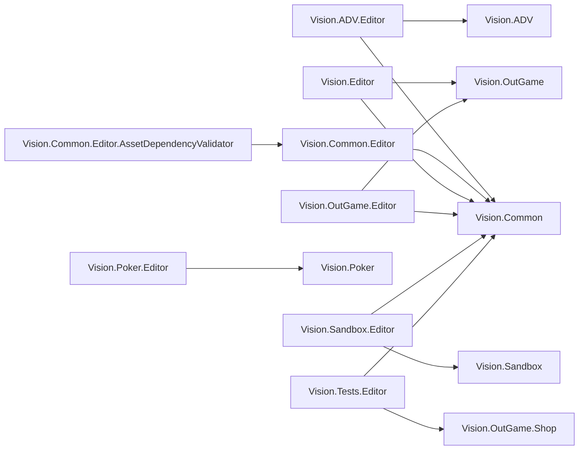

```mermaid
graph LR;
    Vision.ADV.Editor --> Vision.ADV;
    Vision.ADV.Editor --> Vision.Common;
    Vision.Common.Editor.AssetDependencyValidator --> Vision.Common.Editor;
    Vision.Common.Editor --> Vision.Common;
    Vision.Editor --> Vision.Common;
    Vision.Editor --> Vision.OutGame;
    Vision.OutGame.Editor --> Vision.OutGame;
    Vision.OutGame.Editor --> Vision.Common;
    Vision.Poker.Editor --> Vision.Poker;
    Vision.Sandbox.Editor --> Vision.Common;
    Vision.Sandbox.Editor --> Vision.Sandbox;
    Vision.Tests.Editor --> Vision.OutGame.Shop;
    Vision.Tests.Editor --> Vision.Common;

```
