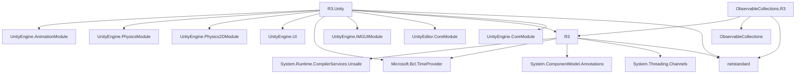

```mermaid
graph TD;
    R3.Unity --> netstandard;
    R3.Unity --> UnityEngine.CoreModule;
    R3.Unity --> R3;
    R3.Unity --> UnityEditor.CoreModule;
    R3.Unity --> UnityEngine.IMGUIModule;
    R3.Unity --> Microsoft.Bcl.TimeProvider;
    R3.Unity --> UnityEngine.UI;
    R3.Unity --> UnityEngine.Physics2DModule;
    R3.Unity --> UnityEngine.PhysicsModule;
    R3.Unity --> UnityEngine.AnimationModule;
    ObservableCollections.R3 --> netstandard;
    ObservableCollections.R3 --> ObservableCollections;
    ObservableCollections.R3 --> R3;
    R3 --> netstandard;
    R3 --> System.Threading.Channels;
    R3 --> System.ComponentModel.Annotations;
    R3 --> Microsoft.Bcl.TimeProvider;
    R3 --> System.Runtime.CompilerServices.Unsafe;

```
